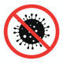

<!-- PROJECT LOGO -->
 

  

  <h3 align="center">iOS Covid Updates -KE</h3>

  

    A simple way to currently view the Covid -19 Statistics in Kenya 
     
    <a href="#explore_the_docs"><strong>Explore the docs »</strong></a>
     
     
    <a href="#view_demo">View Demo</a>
    ·
    <a href="#report_bug">Report Bug</a>
    ·
    <a href="#request_feature">Request Feature</a>
  

<!-- TABLE OF CONTENTS -->

  
Table of Contents

  <ol>
    <li>
      <a href="#about-the-project">About The Project</a>
      <ul>
        <li><a href="#built-with">Built With</a></li>
      </ul>
    </li>
    <li>
      <a href="#getting-started">Getting Started</a>
      <ul>
        <li><a href="#prerequisites">Prerequisites</a></li>
        <li><a href="#installation">Installation</a></li>
      </ul>
    </li>
    <li><a href="#usage">Usage</a></li>
    <li><a href="#usage">Platforms</a></li>
    <li><a href="#roadmap">Roadmap</a></li>
    <li><a href="#contributing">Contributing</a></li>
    <li><a href="#license">License</a></li>
    <li><a href="#contact">Contact</a></li>
    <li><a href="#acknowledgements">Acknowledgements</a></li>
  </ol>

<!-- ABOUT THE PROJECT -->
## About The Project

This is a simple app that shows the current Covid 19 statistics in Kenya. It's as simple as it can get. Just one view after the splashscreen that does take you right at the stats that are originating from a public API hosted at RapidAPI.

To use a different key, open an account at RapidAPI then get a key from the Covid-19 API.

You can clone the project but make sure to use your own key from RapidAPI as the current one may change.

